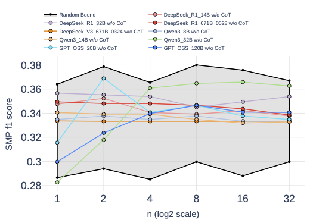
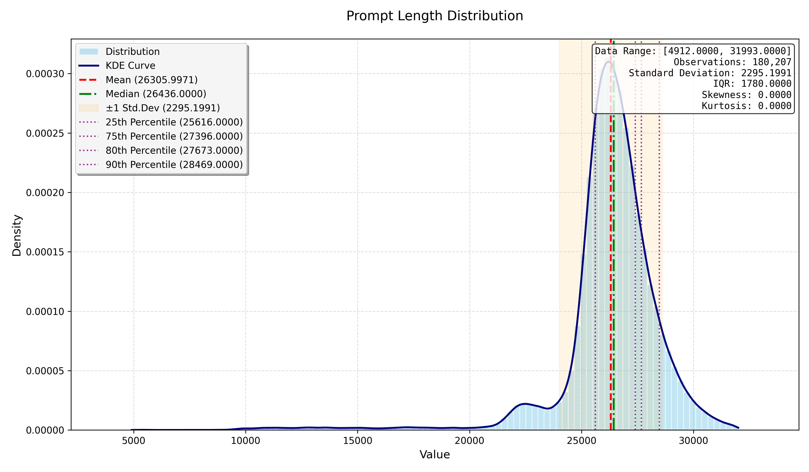

<div id="top"></div>

<p align="center">
  <h1 align="center">
    
    
    
  </h1>
  <h1 align="center">
    RETuning: Upgrading Inference-Time Scaling for Stock Movement Prediction with Large Language Models
  </h1>
  <p align="center">
    <!-- 徽章区域 -->
    <a href="https://arxiv.org/abs/2510.21604" target="_blank">
      
    </a>
    <a href="https://huggingface.co/datasets/linxy/RETuning" target="_blank">
      
    </a>
    <a href="https://huggingface.co/collections/linxy/retuning" target="_blank">
      
    </a>
    <a href="https://huggingface.co/linxy/RETuning-DeepSeek_R1_14B_SFT" target="_blank">
      
    </a>
    <a href="./LICENSE" target="_blank">
    
    </a>
  </p>
  <p align="center">
    <span class="author-block">
      Xueyuan Lin<sup>1,2,3,*</sup>,
    </span>
    <span class="author-block">
      Cehao Yang<sup>1,2,*</sup>,
    </span>
    <span class="author-block">
      Ye Ma<sup>3</sup>,
    </span>
    <span class="author-block">
      Ming Li<sup>3</sup>,
    </span>
    <span class="author-block">
      Rongjunchen Zhang<sup>3</sup>,
    </span>
    <span class="author-block">
      Yang Ni<sup>1</sup>,
    </span>
    <span class="author-block">
      Xiaojun Wu<sup>1,2</sup>,
    </span>
    <span class="author-block">
      Chengjin Xu<sup>2,4</sup>,
    </span>
    <span class="author-block">
      Jian Guo<sup>2,†</sup>,
    </span>
    <span class="author-block">
      Hui Xiong<sup>1,†</sup>
    </span>
  </p>
  <div class="is-size-5 publication-authors" style="margin-top: 10px;">
    <span class="author-block">
      <sup>1</sup>The Hong Kong University of Science and Technology (Guangzhou),
      <sup>2</sup>IDEA Research,
      <sup>3</sup>Hithink RoyalFlush Information Network Co., Ltd,
      <sup>4</sup>DataArc Tech Ltd
    </span>
    <br>
    <span class="author-block">
      <sup>*</sup>Equal contribution,
      <sup>†</sup>Corresponding author
    </span>
  </div>
</p>
<p align="center">
  📖<a href="https://arxiv.org/abs/2510.21604">Paper</a> |
  📊<a href="https://huggingface.co/datasets/linxy/RETuning">Dataset</a> |
  📦<a href="https://huggingface.co/collections/linxy/retuning">Collection</a> |
  🤖<a href="https://huggingface.co/linxy/RETuning-DeepSeek_R1_14B_SFT">Weights</a>
   | 🐙<a href="https://github.com/LinXueyuanStdio/RETuning">GitHub</a>
</p>
<div align="center"></div>
<p align="center">


## 🔔 News

- We are planning to release full Fin-2025. ⭐ Star the repo & Stay tuned!
- **`Nov. 23, 2025`: The training dataset for RL (middle difficulty), as well as full 200k Fin-2024, has been released on 🤗 HuggingFace: [RETuning](https://huggingface.co/datasets/linxy/RETuning).**
- **`Nov. 13, 2025`: Evaluation and SFT dataset is released on 🤗 HuggingFace: [RETuning](https://huggingface.co/datasets/linxy/RETuning).**
- **`Nov. 11, 2025`: We released the model weights on 🤗 HuggingFace: [DeepSeek_R1_14B_SFT](https://huggingface.co/linxy/RETuning-DeepSeek_R1_14B_SFT), [DeepSeek_R1_14B_SFT_GRPO](https://huggingface.co/linxy/RETuning-DeepSeek_R1_14B_SFT_GRPO), [DeepSeek_R1_32B_SFT](https://huggingface.co/linxy/RETuning-DeepSeek_R1_32B_SFT), [DeepSeek_R1_32B_SFT_GRPO](https://huggingface.co/linxy/RETuning-DeepSeek_R1_32B_SFT_GRPO).**
- **`Oct. 24, 2025`: We upload the preprint to [arXiv](https://arxiv.org/abs/2510.21604).**


## 📖 Findings

**Up/Down movements are much more difficult for LLMs to predict.**


**RETuning enables LLMs to benefit from inference-time scaling in stock movement prediction.**


**Most LLMs are bounded by random guessing in stock movement prediction.**



## 🚀 Quick Start

Python>=3.8 and PyTorch>=1.8 are required.

```bash
git clone https://github.com/LinXueyuanStdio/RETuning.git
cd RETuning
pip install -r requirements.txt
```

SFT stage:

```bash
bash pipeline/sft/cold_start_dsr1_14b.sh  # for DeepSeek_R1_14B
bash pipeline/sft/cold_start_dsr1_32b.sh  # for DeepSeek_R1_32B
```

RL stage:

```bash
bash pipeline/rl/train_dsr1_14b.sh  # for DeepSeek_R1_14B
bash pipeline/rl/train_dsr1_32b.sh  # for DeepSeek_R1_32B
```

Evaluation:

```bash
bash pipeline/evaluation/evaluate_14b.sh  # for DeepSeek_R1_14B
bash pipeline/evaluation/evaluate_32b.sh  # for DeepSeek_R1_32B
```

## 📊 Dataset


Prompt length distribution:



## 🤝 Citation

Please consider citing this paper if you use the ```code``` or ```data``` from our work. Thanks a lot :)

(`Xueyuan et al., 2023` preferred, instead of `Lin et al., 2023`)

```bibtex
@article{lin2025retuning0,
  title   = {RETuning: Upgrading Inference-Time Scaling for Stock Movement Prediction with Large Language Models},
  author  = {Xueyuan Lin and Cehao Yang and Ye Ma and Ming Li and Rongjunchen Zhang and Yang Ni and Xiaojun Wu and Chengjin Xu and Jian Guo and Hui Xiong},
  year    = {2025},
  journal = {arXiv preprint arXiv: 2510.21604}
}
```

---

RETuning is released under the [MIT](https://www.apache.org/licenses/LICENSE-2.0) license.

<p align="right">(<a href="#top">back to top</a>)</p>
