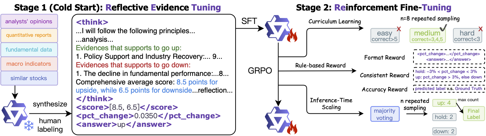
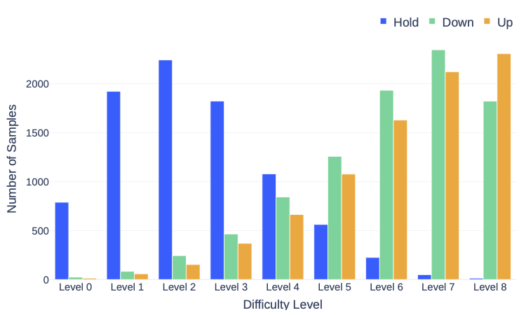
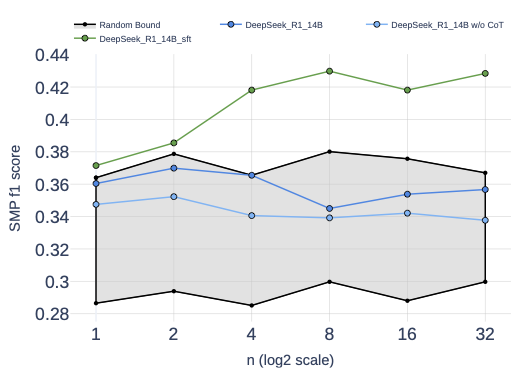
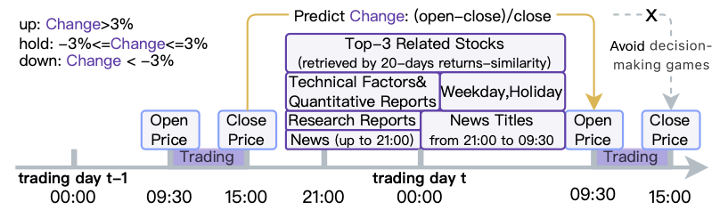

<div id="top"></div>

<div align="center">

# RETuning: Upgrading Inference-Time Scaling for Stock Movement Prediction with Large Language Models #

[](https://pytorch.org/get-started/locally/)


[](https://arxiv.org/abs/2510.21604)
[](https://huggingface.co/datasets/linxy/RETuning)
[](https://huggingface.co/collections/linxy/retuning)
[](https://huggingface.co/linxy/RETuning-DeepSeek_R1_14B_SFT)

</div>



## 🔔 News

- The training dataset for RL (middle & hard difficulty), as well as full 200k Fin-2024, will be released after peer review and publication. Stay tuned!
- **`Nov. 13, 2025`: Evaluation and SFT dataset is released on 🤗 HuggingFace: [RETuning](https://huggingface.co/datasets/linxy/RETuning).**
- **`Nov. 11, 2025`: We released the model weights on 🤗 HuggingFace: [DeepSeek_R1_14B_SFT](https://huggingface.co/linxy/RETuning-DeepSeek_R1_14B_SFT), [DeepSeek_R1_14B_SFT_GRPO](https://huggingface.co/linxy/RETuning-DeepSeek_R1_14B_SFT_GRPO), [DeepSeek_R1_32B_SFT](https://huggingface.co/linxy/RETuning-DeepSeek_R1_32B_SFT), [DeepSeek_R1_32B_SFT_GRPO](https://huggingface.co/linxy/RETuning-DeepSeek_R1_32B_SFT_GRPO).**
- **`Oct. 24, 2025`: We upload the preprint to [arXiv](https://arxiv.org/abs/2510.21604).**


## 📖 Findings

**Up/Down movements are much more difficult for LLMs to predict.**



**LLMs benefit from inference-time scaling in stock movement prediction.**




## 🚀 Quick Start

Python>=3.8 and PyTorch>=1.8 are required.

```bash
git clone https://github.com/LinXueyuanStdio/RETuning.git
cd RETuning
pip install -r requirements.txt
```

SFT stage:

```bash
bash pipeline/sft/cold_start_dsr1_14b.sh  # for DeepSeek_R1_14B
bash pipeline/sft/cold_start_dsr1_32b.sh  # for DeepSeek_R1_32B
```

RL stage:

```bash
bash pipeline/rl/train_dsr1_14b.sh  # for DeepSeek_R1_14B
bash pipeline/rl/train_dsr1_32b.sh  # for DeepSeek_R1_32B
```

Evaluation:

```bash
bash pipeline/evaluation/evaluate_14b.sh  # for DeepSeek_R1_14B
bash pipeline/evaluation/evaluate_32b.sh  # for DeepSeek_R1_32B
```

## 📊 Dataset



## 🤝 Citation

Please consider citing this paper if you use the ```code``` or ```data``` from our work. Thanks a lot :)

(`Xueyuan et al., 2023` preferred, instead of `Lin et al., 2023`)

```bibtex
@article{lin2025retuning0,
  title   = {RETuning: Upgrading Inference-Time Scaling for Stock Movement Prediction with Large Language Models},
  author  = {Xueyuan Lin and Cehao Yang and Ye Ma and Ming Li and Rongjunchen Zhang and Yang Ni and Xiaojun Wu and Chengjin Xu and Jian Guo and Hui Xiong},
  year    = {2025},
  journal = {arXiv preprint arXiv: 2510.21604}
}
```

---

RETuning is released under the [MIT](https://www.apache.org/licenses/LICENSE-2.0) license.

<p align="right">(<a href="#top">back to top</a>)</p>
